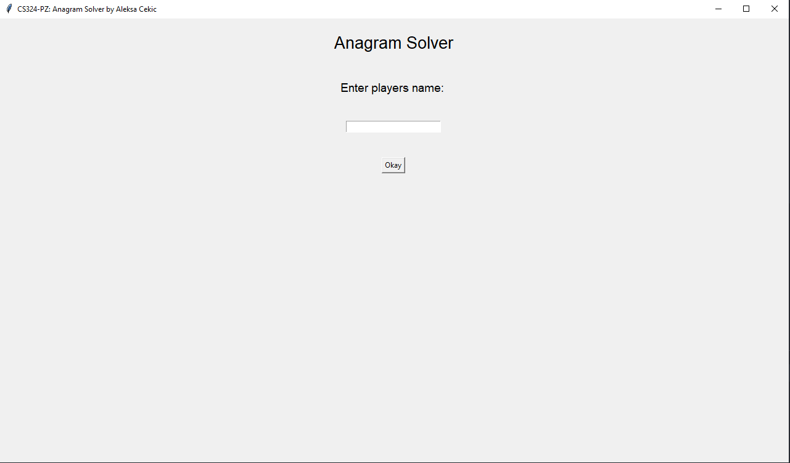
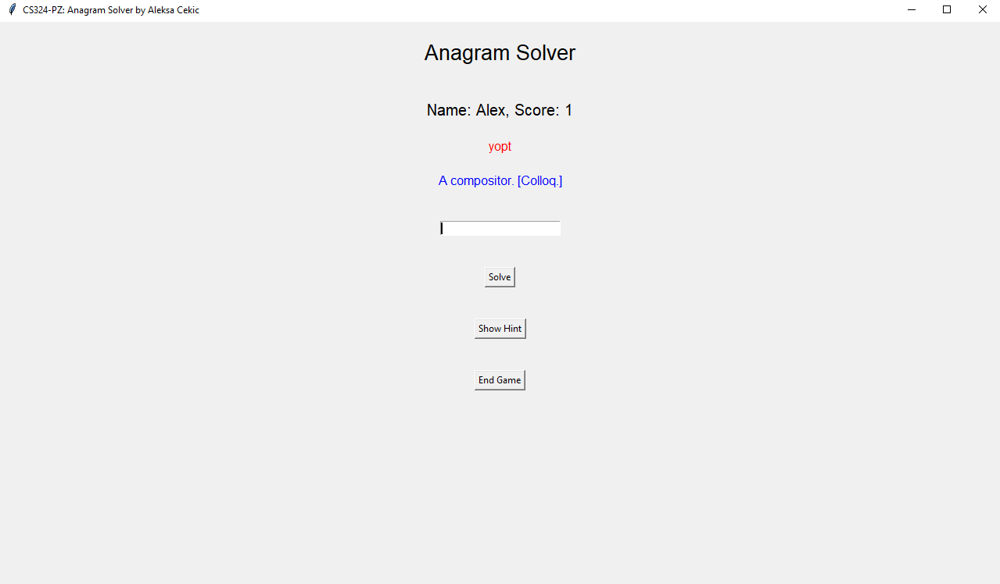

# Anagram Game

This project is done for my Uni class CS324 - Scripting Languages.

## Description

The Player tries to solve an Anagram that is randomly picked from a dictionary.
The Dictionary has been downloaded from this [link](https://github.com/matthewreagan/WebstersEnglishDictionary).

## Functionality

1. Player can track his score,
2. Around 10k words can be generated from a dictionary, depending on the size,
3. Every time player solves an Anagram, he's given a score,
4. Every time player misses an Anagram, a score has been downed by 1.

## Images

   
